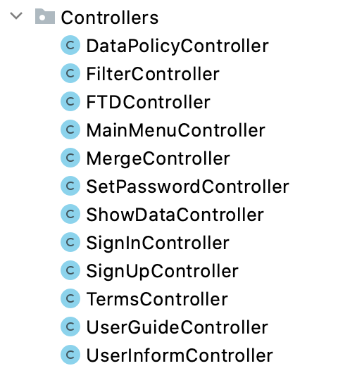

<div align="center">
	
</div>

# Beaver

Beaver is an open-source application to visualize and validate the behavior of dynamic models of credit risk. The target users of our software are researchers, financial institutions, and other end users interested in credit analysis. Credit analysis is an important research direction in the finance field. Up to now, there is almost no free professional software and instructions available. Our Beaver software is not only for validate and visualize the effectiveness of dynamic survival models. Above all, it is an effective tool to take the economic environment and different datasets into consideration. Moreover, each end-user could use their account to ensure data privacy. Besides, to help users' future analysis, visualization graphs generated under different parameters could  be overlapped together for comparison. We will discuss more other features in later parts. All these work aim to make the tool robust and user-friendly, without assuming the end-user will be very computer literate.

Beaver contains the following features:
- Users can register/ recover password/ log in/ log out when they want to use/ exit the software

| Sign in  | Register account | Recover password |
| ------------- | ------------- | ------------- |
|  |  |  |

- Users can import their data after setting the filter condition and select the appropriate data set to apply to a certain model application operation
- Users can choose a model they want from a model list and add new models they have built in Python for experiment
- Users can do the stress testing and select different test scenarios to observe the effect of the stress test on the target data set
- Users can get the model application result in the form of data visualization (e.g. Default Rate/ Log-Likelihood/ Scenario Chart) and get a statistic dashboard showing the economic environment

| Default Rate Graph | Log - Likelihood Graph |
| ------------- | ------------- |
|  |  |

- Users can save/ export the test results obtained from the current model application operation and merge graphs under different parameters to get a complete comparison graph

| Default Rate Merge Graph | Log - Likelihood Merge Graph |
| ------------- | ------------- |
|  |  |

- Users can browse/ rename/ delete the model/ dataset/ scenario and mark which are favored

# Table of contents

1. [ Contributors ](#contributors)
2. [ Arrangement for Meetings ](#arrangement-for-meetings)
3. [ Operating System ](#operating-system)
4. [ Setup Environment Variables ](#environment-variables)
5. [ Install Beaver ](#install)
6. [ Class Diagram ](#diagram)
7. [ Class Description ](#description)
8. [ Design Pattern ](#design-pattern)
9. [ License ](#license)

<a name="contributors"></a>

## Contributors

| Name | Role |
| -------------     | -------------   |
| Dave Towey        | Module Convener |
| Anthony Bellotti  | Supervisor      |
| Yixin SHEN        | Team Member     |
| Donglin JIANG     | Team Member     |
| Ruibin CHEN       | Team Member     |
| Yuan DAI          | Team Member     |
| Yuxin SHI         | Team Member     |
| Yichen ZHANG      | Team Member     |

##### Website URL: [http://cslinux.nottingham.edu.cn/~Team202001/](http://cslinux.nottingham.edu.cn/~Team202001/)

<a name="arrangement-for-meetings"></a>
## Arrangement for Meetings
| Chairperson   | Secretary     |
| ------------- | ------------- |
| Yixin SHEN    | Yuxin SHI     |
| Donglin JIANG | Yuan DAI      |
| Ruibin CHEN   | Yichen ZHANG  |
| Yuxin SHI     | Yixin SHEN    |
| Yuan DAI      | Donglin JIANG |
| Yichen ZHANG  | Ruibin CHEN   |

<a name="operating-system"></a>
## Operating System
Beaver is designed based on ***Windows X64*** operating system and has not been deployed on Linux or Macintosh OS systems. 

Beaver has been deployed and run on Windows 10 X64.

<a name="environment-variables"></a>
## Setup Environment Variables

To successfully run ***Beaver***, following environment variables need to be installed:

- Java Runtime Environment version 1.8

Beaver is developed as a Java project and need to be run on **Java Runtime Environment 1.8** (JRE 1.8) or later versions. 
Or user can can install the **Java Development Kit 11** (JDK 11) or later version as JRE 1.8 is included in it. 
User can download the above from [Java Software | Oracle](https://www.oracle.com/java/) and choose required products.

- Python

Because dynamic models are built in Python, which means the core part of credit risk analysis is implemented in Python. Java Runtime method is used to execute Python script, which makes code productive and dynamic. The main idea of Java Runtime method is to execute Python script through command line and get the execution result from the script output stream that should have been printed in the console. However, some compulsory third-party libraries are not available. As a result, you need to install the required libraries manually. To do this, carry out the following steps:

```bash
pip install numpy
pip install sklearn
pip install pymysql
```
**Attention**: If you use other third party libraries in Python model script, install these libraries in the same way.

<a name="install"></a>
## Install Beaver

1. Download **Beaver** form [http://cslinux.nottingham.edu.cn/~Team202001/](http://cslinux.nottingham.edu.cn/~Team202001/) 
2. Follow the guide step by step to set the installation settings
3. Finish installation

<a name="diagram"></a>
## Class Diagram


<a name="description"></a>
## Class Description

#### Packages Description

| Packet Name | Description |
| -------------     | -------------   |
| Charts        | Charts package is used to run the Python model and generate the line chart |
| Controllers  | Controller package includes all the controller classes for .fxml file to satisfy MVC design pattern    |
| DataProcessing       | DataProcessing package is used to process data and save data to another format/class     |
| InputField    | InputField package is used to store new input field class to check the input is valid or not     |
| Main      | Main package includes software main function to start the software     |
| Music | Music package includes all the classes used to play/stop music, load the music file, all apply singleton design pattern |
| ToolPackage         | ToolPackage package includes all the classes used frequently, e.g. connect database class    |
| TreeControl      | TreeControl package includes all the classes used to generate tree source  |

<section class="hierarchy"> 

<h4 title="Class Hierarchy">Class Hierarchy</h4>
<ul>
<li class="circle">java.lang.Object
<ul>
<li class="circle">javafx.application.Application
<ul>
<li class="circle">Main.<span class="type-name-link">Main</span></a></li>
</ul>
</li>
<li class="circle">Music.<span class="type-name-link">ClickSound</span></a></li>
<li class="circle">Music.<span class="type-name-link">ConfirmSound</span></a></li>
<li class="circle">DataProcessing.<span class="type-name-link">DataOperatorTest</span></a></li>
<li class="circle">Controllers.<span class="type-name-link">DataPolicyController</span></a></li>
<li class="circle">Music.<span class="type-name-link">ErrorSound</span></a></li>
<li class="circle">Controllers.<span class="type-name-link">FilterController</span></a></li>
<li class="circle">Controllers.<span class="type-name-link">FTDController</span></a></li>
<li class="circle">java.util.concurrent.FutureTask&lt;V&gt; (implements java.util.concurrent.RunnableFuture&lt;V&gt;)
<ul>
<li class="circle">javafx.concurrent.Task&lt;V&gt; (implements javafx.event.EventTarget, javafx.concurrent.Worker&lt;V&gt;)
<ul>
<li class="circle">DataProcessing.<span class="type-name-link">DataOperator</span></a></li>
<li class="circle">Charts.<span class="type-name-link">LineChartUtil</span></a></li>
</ul>
</li>
</ul>
</li>
<li class="circle">org.testfx.api.FxRobot (implements org.testfx.api.FxRobotInterface)
<ul>
<li class="circle">org.testfx.framework.junit.ApplicationTest (implements org.testfx.framework.junit.ApplicationFixture)
<ul>
<li class="circle">Controllers.<span class="type-name-link">FilterControllerTest</span></a></li>
<li class="circle">Controllers.<span class="type-name-link">FTDControllerTest</span></a></li>
<li class="circle">Controllers.<span class="type-name-link">MainMenuControllerTest</span></a></li>
<li class="circle">Main.<span class="type-name-link">MainTest</span></a></li>
<li class="circle">Controllers.<span class="type-name-link">MergeControllerTest</span></a></li>
<li class="circle">Controllers.<span class="type-name-link">SetPasswordControllerTest</span></a></li>
<li class="circle">Controllers.<span class="type-name-link">ShowDataControllerTest</span></a></li>
<li class="circle">Controllers.<span class="type-name-link">SignInControllerTest</span></a></li>
<li class="circle">Controllers.<span class="type-name-link">SignUpControllerTest</span></a></li>
<li class="circle">Controllers.<span class="type-name-link">UserInformControllerTest</span></a></li>
</ul>
</li>
</ul>
</li>
<li class="circle">InputField.<span class="type-name-link">InputField</span></a></li>
<li class="circle">InputField.<span class="type-name-link">InputFieldTest</span></a></li>
<li class="circle">ToolPackage.<span class="type-name-link">JdbcUtil</span></a></li>
<li class="circle">Controllers.<span class="type-name-link">MainMenuController</span></a></li>
<li class="circle">Main.<span class="type-name-link">MainStart</span></a></li>
<li class="circle">Controllers.<span class="type-name-link">MergeController</span></a></li>
<li class="circle">DataProcessing.<span class="type-name-link">ScenarioAnalysis</span></a></li>
<li class="circle">Controllers.<span class="type-name-link">SetPasswordController</span></a></li>
<li class="circle">Controllers.<span class="type-name-link">ShowDataController</span></a></li>
<li class="circle">Controllers.<span class="type-name-link">SignInController</span></a></li>
<li class="circle">Controllers.<span class="type-name-link">SignUpController</span></a></li>
<li class="circle">Controllers.<span class="type-name-link">TermsController</span></a></li>
<li class="circle">Music.<span class="type-name-link">ToggleSound</span></a></li>
<li class="circle">TreeControl.<span class="type-name-link">TreeItemCollection</span></a></li>
<li class="circle">TreeControl.<span class="type-name-link">TreeItemCollectionTest</span></a></li>
<li class="circle">TreeControl.<span class="type-name-link">TreeItemObject</span></a></li>
<li class="circle">TreeControl.<span class="type-name-link">TreeItemObjectTest</span></a></li>
<li class="circle">Controllers.<span class="type-name-link">UserGuideController</span></a></li>
<li class="circle">Controllers.<span class="type-name-link">UserInformController</span></a></li>
</ul>
</li>
</ul>
</section>

<a name="design-pattern"></a>

## Design Pattern

We have used several design patterns (e.g. Model - View - Controller (MVC), Singleton) to make our code more organized and easy for us to maintain. These kinds of design patterns could help developers write code faster by providing a picture of how you are implementing the design. Besides, it encourages code reuse and accommodates change by supplying well-tested mechanisms for delegation and composition.

#### Singleton Design Pattern

Singleton restricts the number of instantiation of a class, which means only one instance of the class exists in the java virtual machine. A Singleton encapsulates a unique resource and makes it readily available throughout the application.

| Singleton | Singleton Class |
| -------------     | -------------   |
|        |  |


#### MVC Design Pattern

MVC is an architecture or a software design pattern that makes creating huge applications easy. It separates user interface and related program logic into three interconnected elements: Model, View, and Controller. Model is the central part of the program, it is responsible for data processing and calculation logic. View is where the user operates directly, it may reflect the calculation results of model calculation through the form of table and chart. Controller is the bridge between model and view, it accepts input and converts it to commands for the model or view.

| MVC | Model | View | Controller|
| -------------     | -------------   | ------------- | ------------- |
|  |  |  |   |


<a name="licence"></a>

## License
[MIT](https://choosealicense.com/licenses/mit/)
