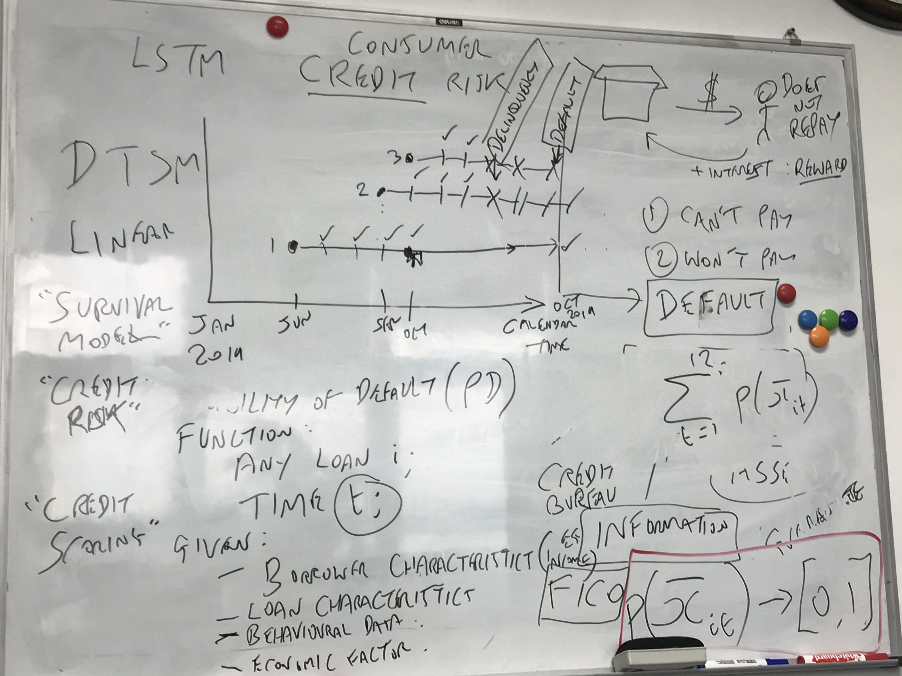

# No.1 Meeting Minutes 

2020/10/16  Friday

| Time: 12:00-13:30        | Venue: PMB419               |
| ------------------------ | --------------------------- |
| **Supervisor: Tony**     | **Attendance: All members** |
| **Chairman: Yixin SHEN** | **Secretary: Yuxin SHI**    |

### Agenda

**Self-introduction**

**Project discussion and Q&A session**

**Arrange work before next meeting**

**A quick lesson** 

#### **Self-introduction**

Took turns to introduce our basic information and experience to let supervisor know more about us.

####  **Project discussion and Q&A session**

Firstly, supervisor told us that we are not familiar with this area , so it's necessary  to read some academic literature before our next meeting, and we can share them with each other. To know more about this topic, like credit risk and working process, we could role-play a case study . In the whole meeting, we asked some questions and the key points of answers are classified as follow:

  **Project requirement :**

1. It's not needed to create model by ourselves because supervisor will deliver the model to us. But we need to know more details about the models and find out more models by ourselves.
2. This project is not based on AI system, we need to complete a software visualization and validation tool, we can do machine learning work, building work and some others.
3. Our first responsibility is business analysis, to complete what supervisor(client) requested, during this process, we should implement the interface from java to python, Gantt chart, UML design, software design, and html. We also need to test code as group.
4. The website page just include simple introduction of project ,team and supervisor etc.
5. The users are only researchers and financial institutions (financial specialist ).
6. We need to complete prototype functionality by the end of this semester.

  **Format requirement:**

1. There is no hard rules so we can design the software using the language we familiar with.
2. It is uncertain if we can use template for website, and it is not necessary to use non-standard software
3. We could use GitLab to control version if we want.
4. we could use LaTex (Miktex + Texmaker) to finish the reports during the project.

  **Other advice:**

1. Use Microsoft Teams to communicate, and invite supervisor to our Gitlab group.

2. read more academic literature this weekend.

3. Choose only one speaker to pre next semester.

   

#### Arranged works:

- read and research more about:

  - Survival model
  - Credit risk
    
  - Credit scoring
  
- summarize questions about functionality requirements and ask at next meeting. (Everyone)

- Arrangement for meetings

  - | Chairperson   | Secretary     |
    | ------------- | ------------- |
    | Yixin SHEN    | Yuxin SHI     |
    | Donglin JIANG | Yuan DAI      |
    | Ruibin CHEN   | Yichen ZHANG  |
    | Yuxin SHI     | Yixin SHEN    |
    | Yuan DAI      | Donglin JIANG |
    | Yichen ZHANG  | Ruibin CHEN   |

- Team project website - Yuan DAI ***DDL: 10.19***

- Gitlab group - Yixin SHEN ***DDL: 10.19***

- ***Next informal meeting time: 10.18/10.19***

#### A quick lesson 

Gave the primary knowledge of credit risk, what is default and some measures, the probability of default, what is dynamic model,  the interface between java and python.

 

