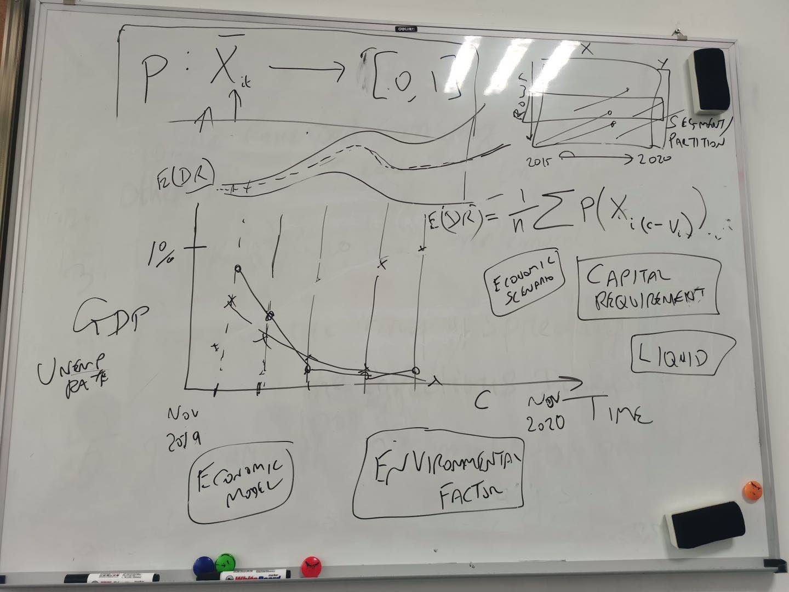

# No.3 Meeting Minutes

2020/10/27 Tuesday

| Time: 9:00-10:00         | Venue: PMB449               |
| ------------------------ | --------------------------- |
| **Supervisor: Tony**     | **Attendance: All members** |
| **Chairman: Ruibin Chen**| **Secretary: Yichen Zhang** |

### Agenda

**Current progress discussion**

**Plan for next week**

**Q&A session**

**Task arrangement**

**A quick lesson**

#### **Current progress discussion**

- Preliminarily think about requirement collection and analysis draft from brief and others.

- Gantt chart completed.

- All team members have basic reading of resource paper.

- Website is available on cslinux: [Http://cslinux.nottingham.edu.cn/~Team202001/](http://cslinux.nottingham.edu.cn/~Team202001/)

- The ethics checklist has been submitted through the moodle.

#### **Plan for next week**

1. Complete the requirement document, supplement non-functional requirement
2. Validate requirements
3. Complete UML: Use case diagram, sequence diagram, activity diagram
4. Preliminarily overview the given model
5. Do research on dynamic model and other related area.
6. Review conditional probability and other mathematics methods.

#### **Q&A session**

**Q:** Do we need to include registration and login functions?

**A:** Yes, it's a good functionality.

**Q:** Should users add their own models into the system?

**A:** The software should enable users to add their own models to it. At the end of the project, you need to mainly complete the Java interface, as well as some dynamic model functions in Python.

**Q:** What content or indicators should be included in the diagnostics dashboard?

**A:** See a quick lesson for details.

**Q:** For the result of visualization, do we need to save the result graph of each run?

**A:** Yes, it's a good idea.

#### **A quick lesson**

1. introduction of the core function.
2. Visualization is the core of the project.
3. User can modify the environmental factors to do the stress testing with model.
4. Capital requirement.
5. Economic model.

#### **Task arrangement**

1. Requirement Validation.
2. Continue reading resource paper.
3. UML improvement.
4. **Big Short (Group movie)**

