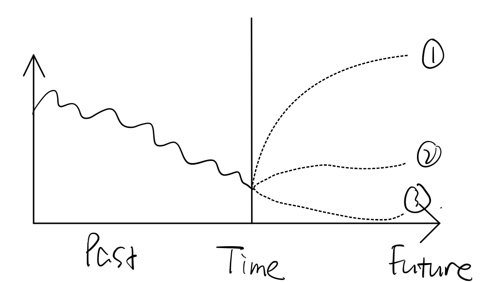
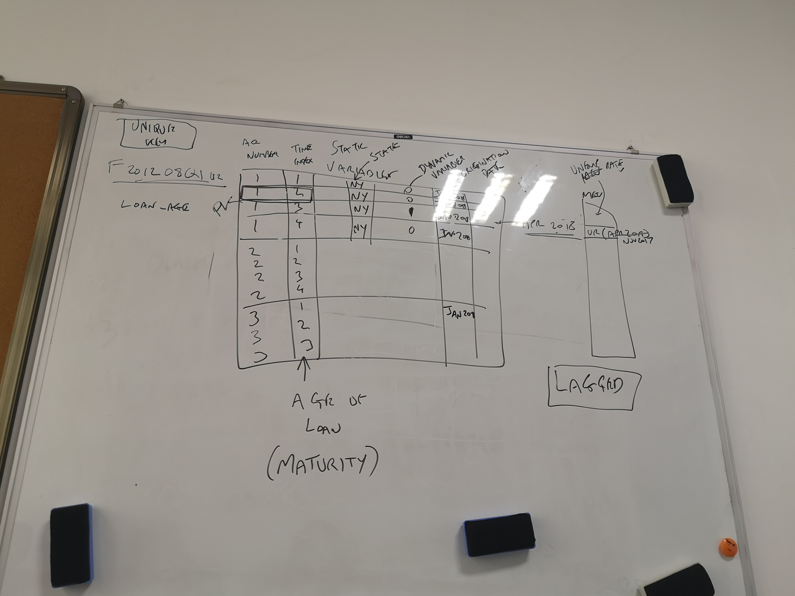

# No.4 Meeting Minutes

2020/11/03 Tuesday

| Time: 9:00-10:00        | Venue: PMB449               |
| ----------------------- | --------------------------- |
| **Supervisor: Tony**    | **Attendance: All members** |
| **Chairman: Yuxin SHI** | **Secretary: Yixin SHEN**   |

### Agenda

**Q&A session**

**Plan for next week**

**A quick lesson**

#### **Current progress discussion**

- Complete requirements and specification draft
- Complete UML diagrams draft
- Divide team into sub-teams for system architecture and GUI design

#### **Plan for next week**

1. Modify the requirements and specification draft
2. Modify the UML diagrams based on client's advice
3. Start GUI design prototyping
5. Search system architecture solutions

#### Advices for Docs

1. Regarding to the activity diagram, add a central activity point from which the user can go back to change data, add filters, choose different models to make it less linear
2. May give the user some optional stress testing scenarios when user want to do the stress testing (scenario_1, scenario_2, scenario_3, etc.)
3. Suppose the long data sets are already stored in the end-users' database
4. In the dashboard, basically it should have the PD figure, however there are many other futures like p-value to be added.
5. Regarding to the actors part, it is better to reflect three different identities in the text file, i.e risk manager, model developers, university researchers. But they utilize the same functionalities, in the figure may need not to show that
6. Read Brenden/Croon's new paper

#### **A quick lesson**

1. Data structure of account level data set

#### **Task arrangement**

1. Complete specifications draft based on requirements
2. Website maintenance
3. Continue reading resource paper
4. UML improvement
5. GUI design
6. Search for system architecture solutions
7. Informal meeting ---- 11/8 19:00

