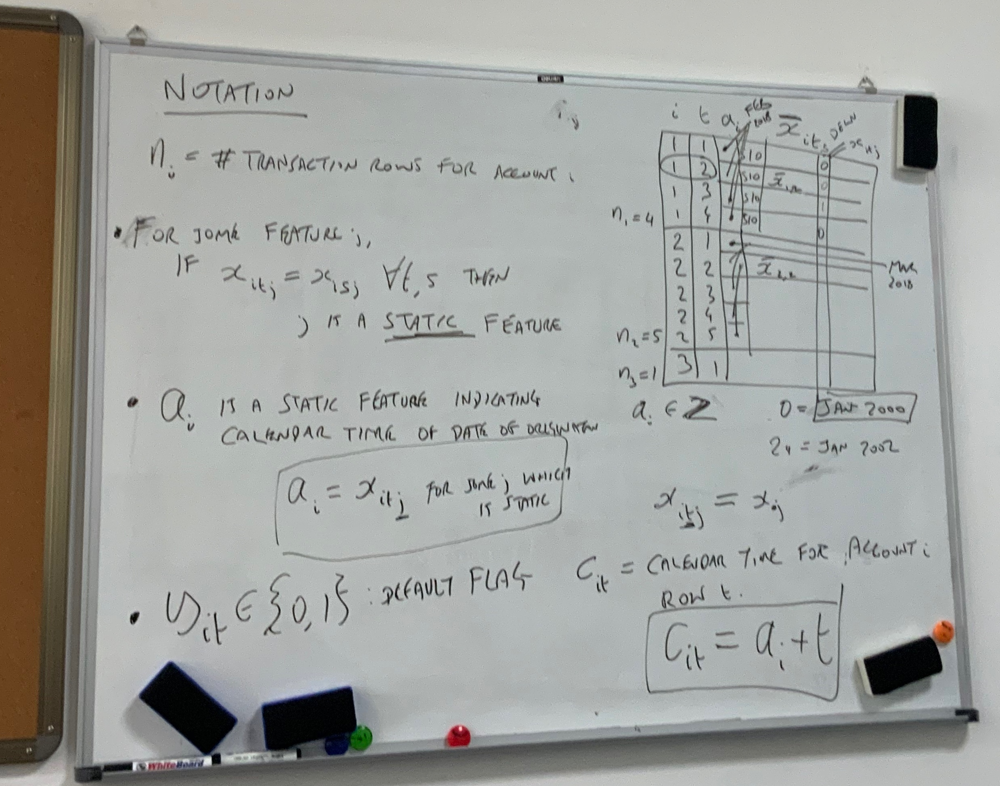

# No.5 Meeting Minutes 

2020/11/10  Tuesday

| Time: 9:00-10:00       | Venue: PMB449                |
| ---------------------- | ---------------------------- |
| **Supervisor: Tony**   | **Attendance: All members**  |
| **Chairman: Yuan Dai** | **Secretary: Donglin Jiang** |

### Agenda

**Q&A session**

**Advices for project**

**A quick lesson** 

**Plan for next week**

#### **Q&A session**

**Q:** Are the models provided to us for testing directly in python or in word so that we can add them to our software without building extra python files?

**A:** For the prototype in this semester, you do not need to build the models in python, Java is OK. But you can do it in python if you want, it depends.

**Q:** Shall we embed scenarios in code? Are the scenarios been built by systems we write?

**A:** You should not hard code the scenario. It is better to control the scenario in a file. User can add more scenario through adding scenario file. If user wants to change the scenario, they will change file rather than  the code.

**Q:** What’s the difference between “Default Rate” and “Possibility of default”? Are them on the level of portfolio & account respectively?

**A:** For "Default Rate", it is an average value, which means the ratio of default accounts and total number of accounts.

#### **Advices for project**
1. In DBI module, you use PHP to connect front end with database. PHP is an option, you should think a way to communicate Java, python and sql.
2. You should think a method to draw the visualization figure.

#### **A quick lesson**
1. Specific meaning of all variables in the given dataset

2. Connection between simDTS and simMEV

3. The method to calculate Default Rate (DR)

#### **Plan for next week and task arrangement**
1. GUI design
2. Website maintenance
3. Convert the given discrete time survival model to python file
4. Modify sequence and use case diagram
5. Find some literatures about the method to communicate python, sql and Java

